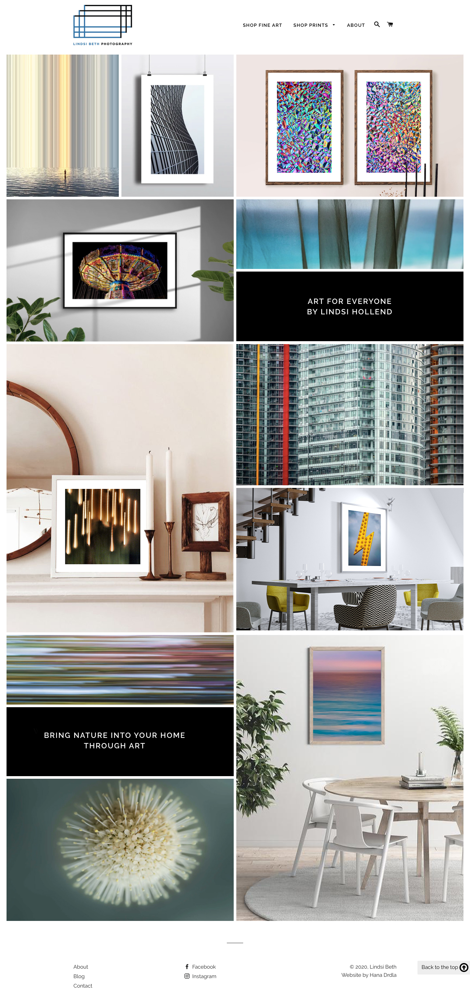
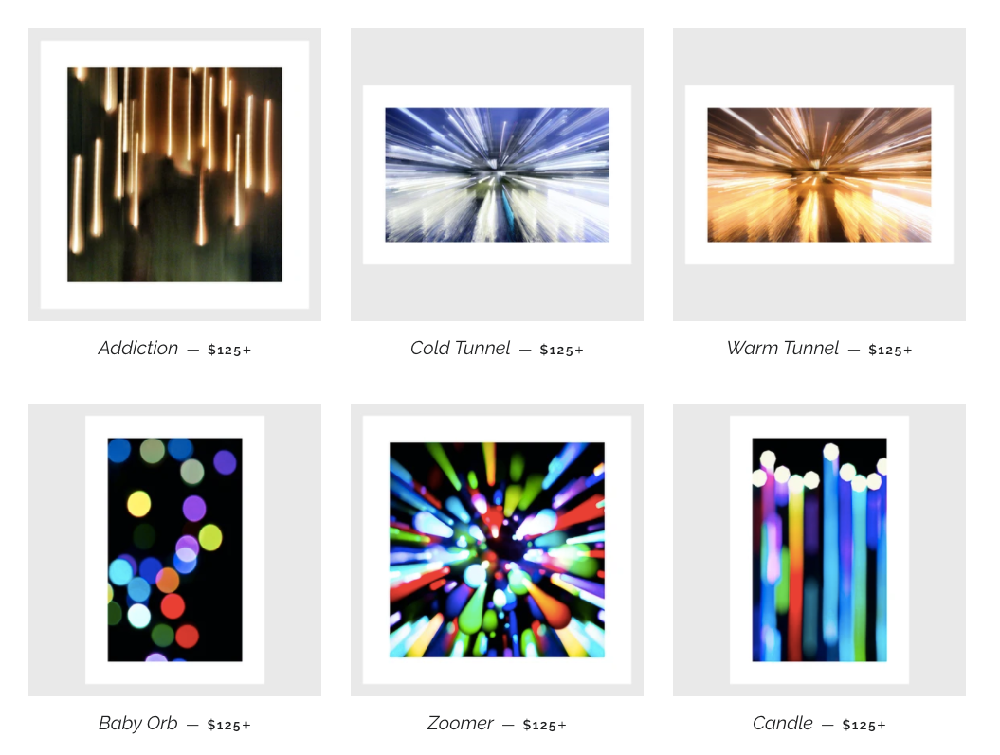

My favourite projects to work on are those when the client wants something custom. When it comes to Shopify stores, 90% off them look alike, and can easily be identified as a Shopify store. At this point, I can often spot what theme they are using within seconds. So when I’m given the opportunity to develop something different, I jump on it.

In this case, my client was a photographer looking to sell prints of her work. She opted to go with a free theme that suited her aesthetic and needs. We chose Brooklyn as it was sophisticated and minimalist so her artwork was sure to stand out. Effort was directed to make an original home page design to feature her favourite works.

Below you’ll see the custom gallery section build on Shopify. Each image links to its product page, and the text and text background color are easily customizable from the store editor. The gallery is made up of four rows that can be reordered. The section was coded from scratch with an emphasis on maximizing flexibility of the layout, and ease of use for the client.

We filled the gallery with a mix of product images and mockups to show visitors what the art could look like in a home.

Beyond the home page, there was the challenge of the prints all being different shapes: portrait, landscape, and square. To achieve a uniform appearance on the collection page, I chose to create a square cover image for each of these pictures, with a light grey border. This ensured a neat and uniform uniform look with all titles and images on the same horizontal line.

