Shopify is so appealing as an e-commerce platform because it's easy for the somewhat tech-literate person to launch their own store, but it also has the capability to go above and beyond the usual Shopify store themes, and create some incredible online shopping experiences. A mix of brilliant product photography, and beautiful design can create an unforgettable shopping experience customers.

Let's take a look at 17 of the best and most unique e-commerce stores built on Shopify.

### Unique Shopify Websites

 

### 1. Benni

The burst of color on <a href="https://meetbenni.com/?ref=hanadrdla" target="_blank">Benni</a>'s website instantly pulls you in. Scrolling through the page is like visiting an amusement park with fun fonts, gifs, and a beautifully cohesive color scheme. What's genius here is the toggle right at the top of the page that invites the visitor to select their function: Immunity or Sleep. Then it offers them the related product and switches the entire color scheme accordingly. Being a 2-product store, the customer doesn't even need to leave the home page if they don't want to. Interestingly, all these customizations have been done starting with the Debut theme.

### 2. Sorry I Have No Filter

Exactly as expected by the store name, <a href="https://sorryihavenofilter.com/?ref=hanadrdla" target="_blank">Sorry I Have No Filter</a> follows zero traditional e-commerce conventions and creates a super fun experience for the visitor. Its About page rains down middle fingers that tumble over the text and pile up at the bottom of the page. Genius. Hovering over collection images makes you laugh with its sarcastic messaging. Its animations make you never want to leave the website because there is a surprise around every corner. Another one of my favorite details is the slide out product page that you can scroll out of and keep shopping for a seamless experience.

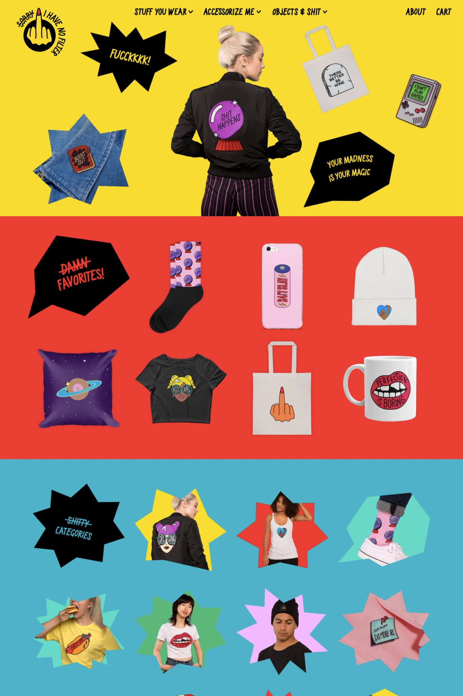

### 3. Haus

What looks to be made for young socialites, <a href="https://drink.haus/?ref=hanadrdla" target="_blank">Haus</a>'s website has a simultaneously vintage and classy feel. Most unique are its product images which are arch shaped and feature a collage of both the product, and the lifestyle. Other lifestyle images scream "have a good time!". Their product page is another winner with drink recipes, nutritional information, membership info and reviews, all while looking stun-ning!

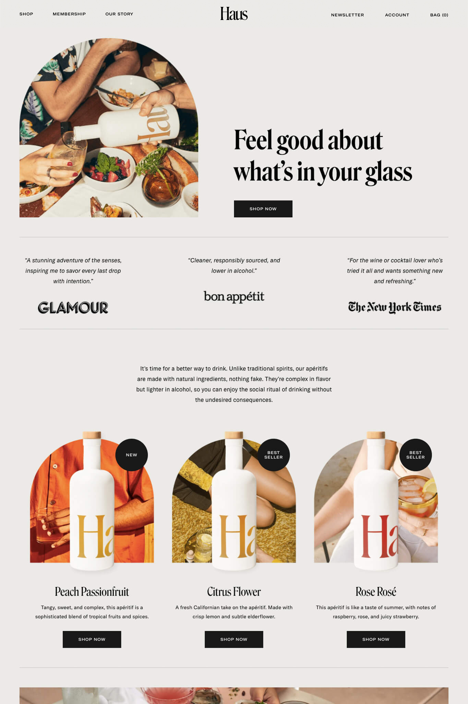

### 4. Everyday Needs

Minimalism at its... most minimal, <a href="https://www.everyday-needs.com/?ref=hanadrdla" target="_blank">Everyday Needs</a> creates a sensory experience of what having their products in your home feels like. It's uncluttered and made to help you appreciate the beauty of both your home and surroundings. Its editorial layout isn't common in e-commerce and gives a feeling of sophistication.

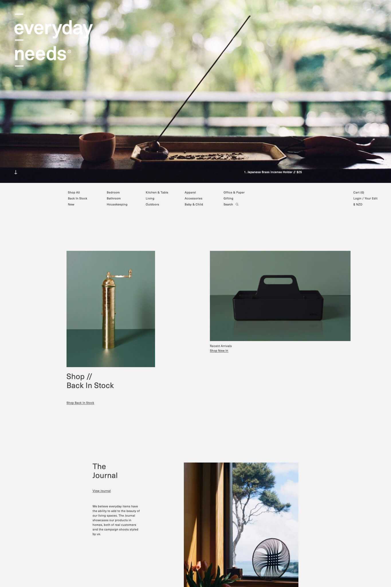

### 5. Great Jones Goods

Never has cooking looked so fun than on the <a href="https://greatjonesgoods.com/?ref=hanadrdla" target="_blank">Great Jones</a> website. Visiting this website feels like entering your grandmother's cookbook starting with their storytelling-esque logo and their use of illustrations that overlap onto the website, parallax style. I was incredibly surprised when hovering over the product grid and saw that pot lids opened and pans filled with illustrated food. My cursor also changed for each product. Absolutely adorable and kept me in this nostalgic feeling story. Who wouldn't want these products to be part of forming their family story?

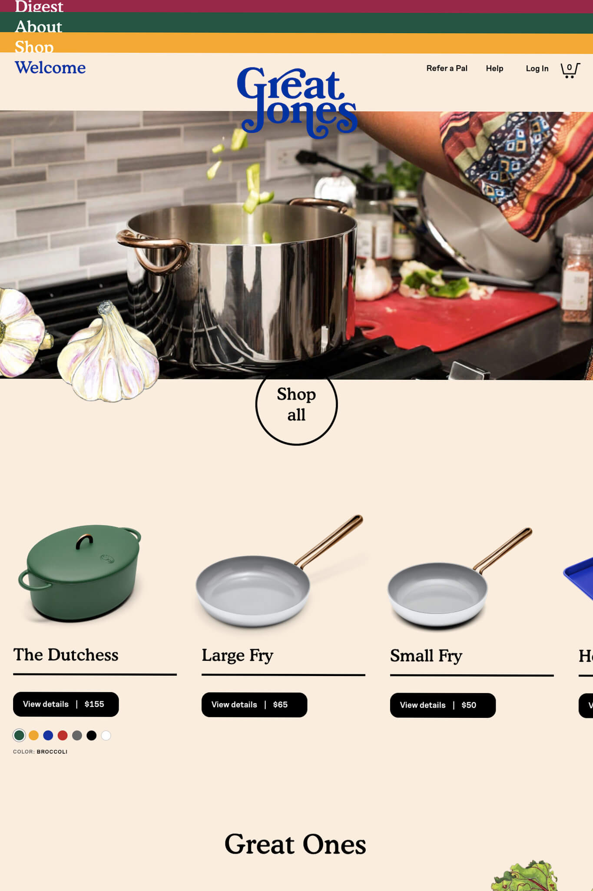

### 6. Misfits Market

A longtime favourite of mine, the <a href="https://www.misfitsmarket.com/?ref=hanadrdla" target="_blank">Misfits Market</a> website makes buying vegetables a fun and rewarding purchase. They embrace the _perceived_ imperfections of their product and bring that through design elements of oblong shapes and overly simple illustrations. Their branding is seriously on point. I love how on their product page, they feature Instagram posts of what customers have received so there's no mystery in what you're getting! What's neat is that it seems that their site requires minimal maintenance too.

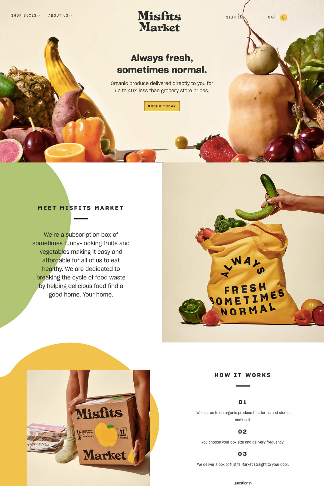

### 7. Usual

The <a href="https://usualwines.com/?ref=hanadrdla" target="_blank">Usual</a> website feels like a throwback to a cut and paste magazine collage from your pre-teen years. This is due to the black and white simple grid layout and the product images that don't match one another. It definitely wins points for originality in the wine and e-commerce spheres.

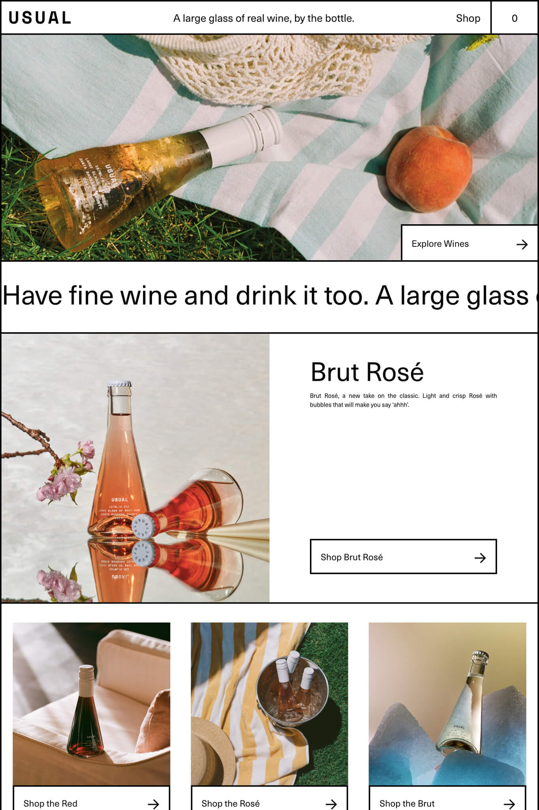

### 8. Sundaily

A really beautiful website that is hard not to like from <a href="https://getsundaily.com/?ref=hanadrdla" target="_blank">Sundaily</a>. Their button styles, custom icons, values and testimonials make you love and trust this brand immediately. The design is professional, fun and most importantly, communicates everything that the customer wants to know about this product.

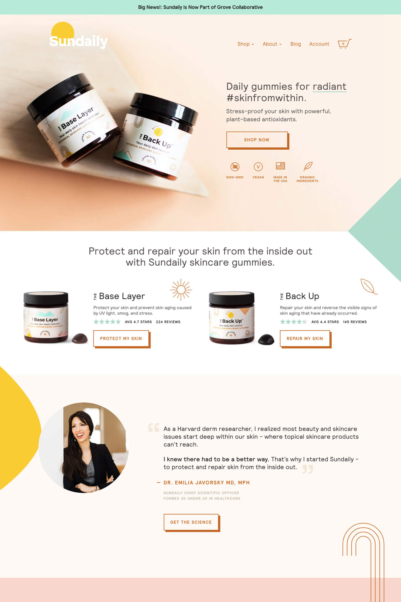

### 9. Smalls

This list would not be complete without a cat-related website. <a href="https://www.smalls.com/?ref=hanadrdla" target="_blank">Smalls</a> takes a non-traditional approach to the pet industry, using imagery and graphics that speak to a below-40, cat-loving audience. Shoppers see how this brand fits into their lives and understand that their beloved pet deserves something better than what you can get in the supermarket. They have a unique value proposition of a custom food blend for the specific needs of your cat. I love the unique layout of their collection page, and the strong call to action halfway through the page. Meow!

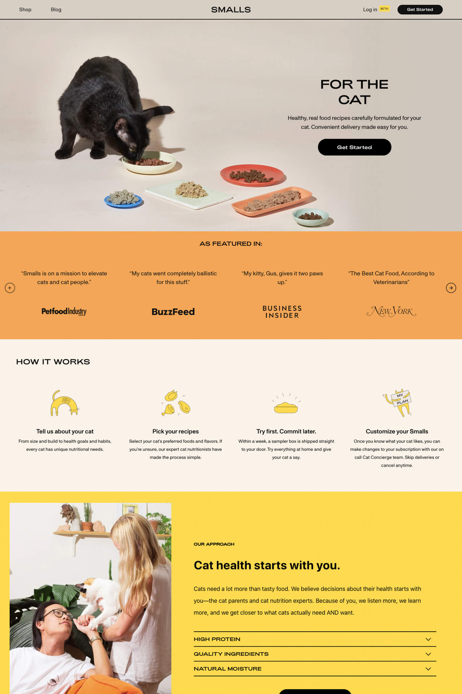

### 10. Thelma

Looks incredibly good, without being overwhelming.<a href="https://shopthelma.com/?ref=hanadrdla" target="_blank">Thelma</a>'s website gives you exactly what you need and no more. They're confident in their product and don't fill the pages with a ton of images or text to try to convince you of anything. I enjoy their product pages that maintain a split screen where the product image stays on the left side, as you scroll through the product details on the right. Very elegant.

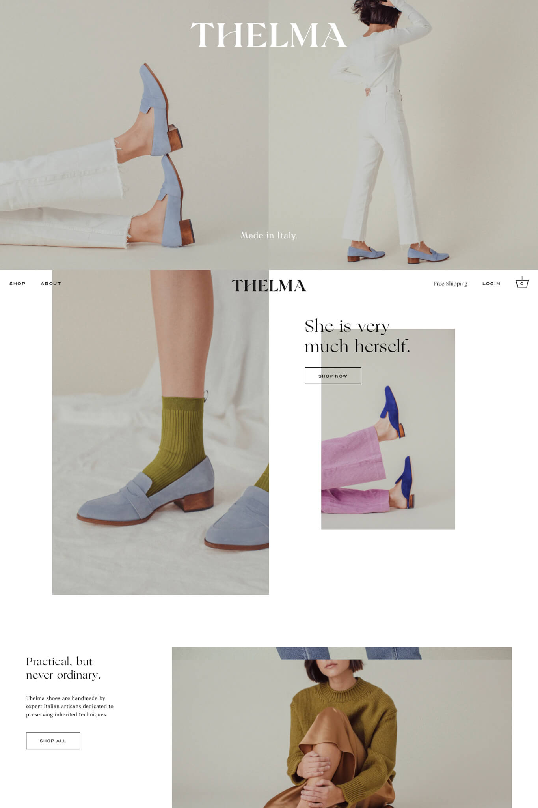

### 11. Noocity

The <a href="https://www.noocity.com/?ref=hanadrdla" target="_blank">Noocity</a> website welcomes you with a split screen slider presenting what their brand is about. The product pages are what make the site really special. Here's where simple icons, technical drawings, and photos of the product in use do the selling. Do I want one? No, I want four.

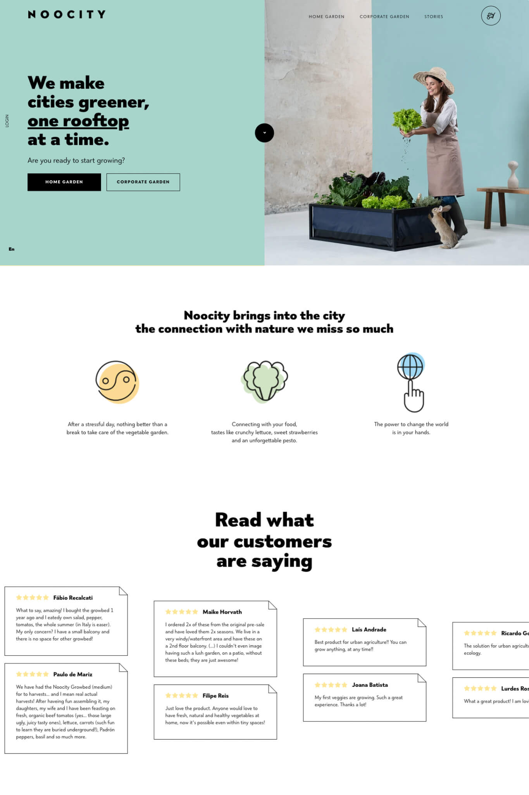

### 12. East Fork

The deeper I went into <a href="https://eastfork.com/?ref=hanadrdla" target="_blank">East Fork</a>'s website, the more convinced I was of their product. At first glance, the site is beautiful but not outstanding. Then little details and handmade touches start to appear and you realize what the brand is really about. Some of my favorite details begin with the letters in the logo slowly changing into pottery pieces as you scroll down the page. Then there are the charcoal drawn crosses over sold out variant color swatches. I was sold on the quality of their products with the mini stories halfway down the product pages.

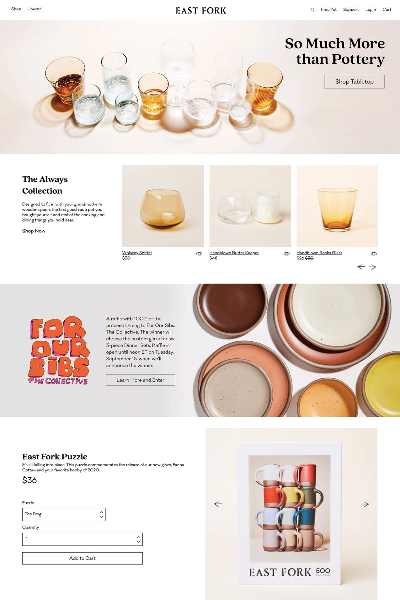

### 13. Omsom

A little like walking into a really loud restaurant, the experience on <a href="https://omsom.com/?ref=hanadrdla" target="_blank">Omsom</a>'s website grabs you from the moment you arrive. Crazy button shapes and non-stop animations keep your attention as you figure out what's cooking. Definitely 10/10 points for originality. A necessity is their quick video recipe built into each product page.

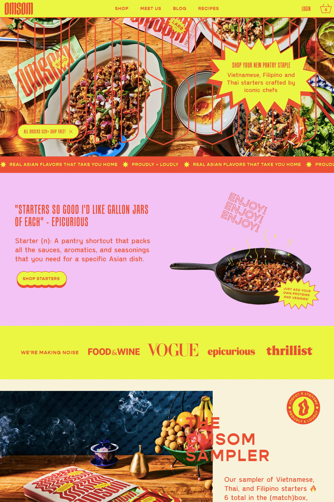

### 14. Drink Hydrant

Everything about <a href="https://www.drinkhydrant.com/?ref=hanadrdla" target="_blank">Hydrant</a>'s website is fun and trendy. Their bold fonts, color blocks and mysterious "where is the rest of the body?" product photography, they have me sold. An added bonus is the colorful product picker that reminds you of going to a candy shop. I definitely want to hydrate with this brand.

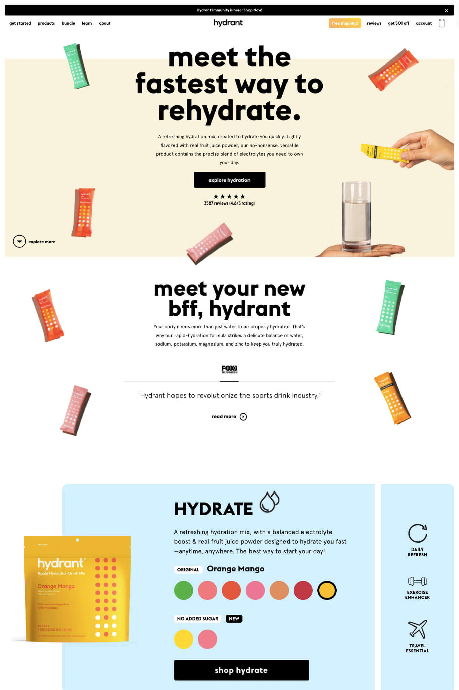

### 15. Kinfield

There is seriously nothing to dislike about <a href="https://kinfield.com/?ref=hanadrdla" target="_blank">Kinfield</a>'s website. It's fresh, friendly and makes me feel like I've known them all along. A true example of selling the lifestyle, not the product. I like how they've taken the signature squiggle from their packaging and incorporated it throughout the site. Their product review section is amazing because it allows customers to rate the product for different categories. Also adorable is the tiny circular gallery images to slide through on the product page. This website gets better and better the longer I stay on it.

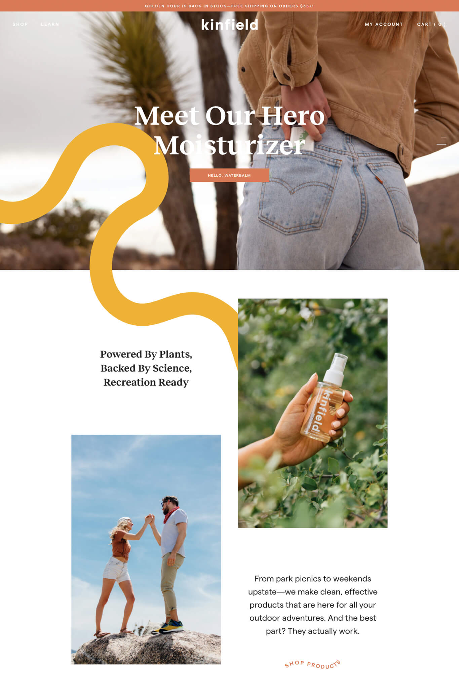

### 16. Lunya

Although having a very traditional e-commerce layout, <a href="https://www.lunya.co/?ref=hanadrdla" target="_blank">Lunya</a>'s website screams "Luxury". The colors and light in their photos are so perfectly crafted that a sense of calmness overwhelms you. True good design really is that... it makes you feel good and you can't necessary identify why. Subtle icon animations add some extra movement to the site and the grid layout on the product page is effortlessly chic, just as you'll feel in their clothes.

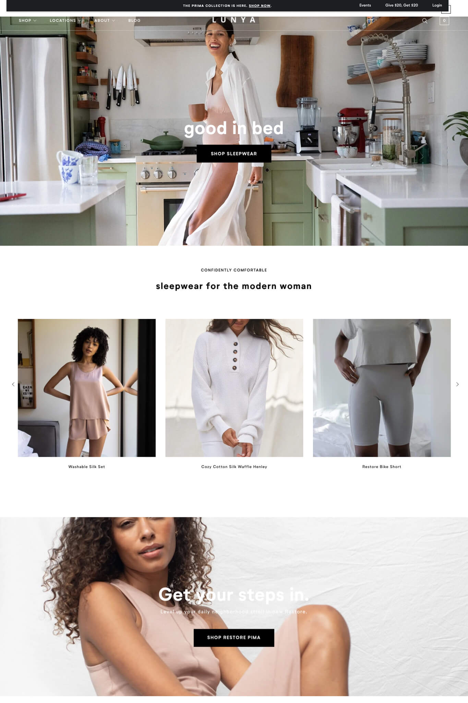

### 17. Golde

After cats, my favorite thing is tea so when I found <a href="https://golde.co/?ref=hanadrdla" target="_blank">Golde</a>'s website, it had to be on the list! The layout is quite simple but their product photography and color scheme pull everything together nicely to make their branding stand out even on a white and minimal site. Something I've never seen on another site is the product title and price _above_ the product image on the collections page. Mmm I want.

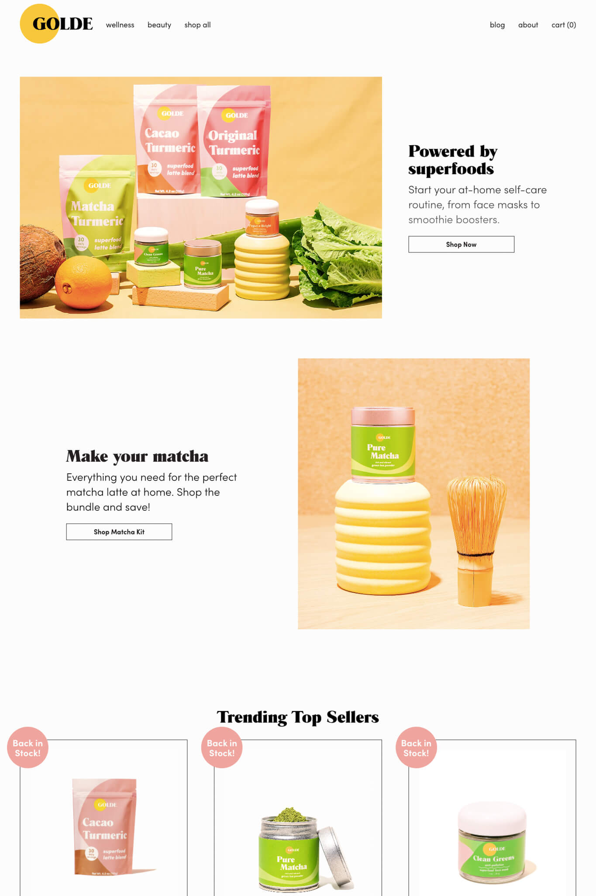

 

Is there a site you think deserves to be featured here? <a href="https://twitter.com/hdrdla" target="_blank">Let me know</a>!
