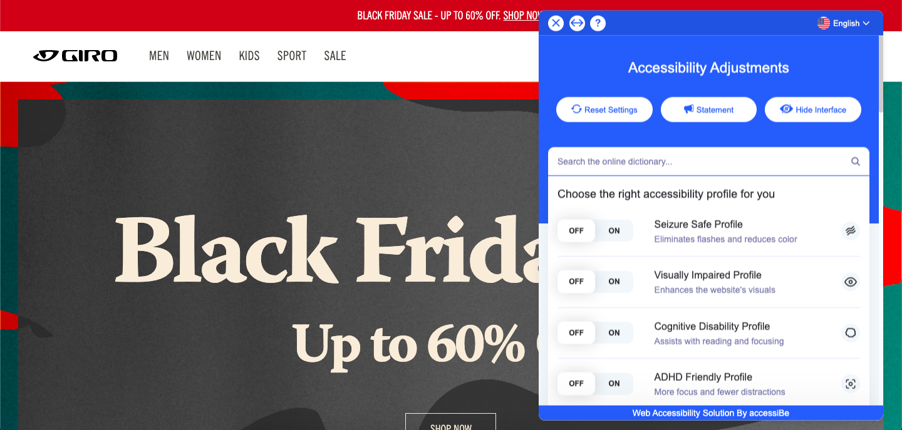
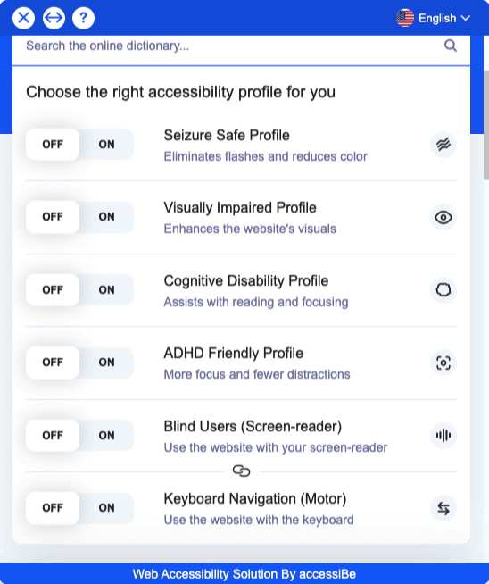

In recent years, web accessibility has become an important consideration in web development as governments enforce criteria for inclusive digital content. 

Web accessibility is when websites are built so that people with disabilities can use them. Specifically, people can easily navigate and interact with website content although they may have a visual, auditory, cognitive, neurological, physical or speech disability. A simple example of an accessible feature would be to include subtitles on a video. You can imagine that many accessibility features could also benefit those without a disability. Imagine people using small screens, not having access to speakers or headphones, and people who have forgotten their reading glasses. Ignoring accessibility is excluding customers with *(and without)* disabilities which will inevitably lead to them leaving your website. 

You may be legally required to have an accessible website. In Ontario, Canada, those who must comply with web accessibility regulations are: private or non-profit organizations with 50+ employees, and public sector organizations. And the level of compliance continues to increase. 

Even if not legally required, I’ve already mentioned just a few reasons above that you would want your website to be accessible for all people. Later in this blog, I’ll let you know of some changes that anyone can make to their website in effort to make it more accessible. 

If you’re looking for specific tools to help make your website more accessible, look for <a href="https://www.w3.org/WAI/standards-guidelines/wcag/" target="_blank">WCAG</a> compliant tools and look into the laws for your local region. For example, <a href="https://www.aoda.ca/" target="_blank">AODA</a> is used in Ontario, Canada and ADA is a federal standard in the United States. WCAG (Worldwide Content Accessibility Guidelines) is a global standard.

My interest in this topic has grown as companies are being sued for lack of accessibility on their websites. That includes Home Depot, Beyonce Knowles, Sephora and Amazon. More recently, Gimlet Media (a podcasting company) was also sued for their podcasts not being accessible.

That’s why I was surprised and pleased to stumble upon an accessibility tool while browsing Giro’s website. Giro is using the <a href="https://accessibe.com/" target="_blank">accessiBe</a> tool that allows users to adjust accessibility settings to use premade user profiles, or adjust individual aspects such as font size, colors, and reading guides to help you navigate the content. Just testing out the settings they offer immediately helps you understand how a user’s experience could be made so much better by offering these tools. I encourage you to try it out. A little digging into accessiBe’s website and I found that their tool can be <a href="https://accessibe.com/support/installation/shopify-installation" target="_blank">easily installated into a Shopify store</a>. The pricing for this tool starts at $490/USD per year - a small investment when compared to a lawsuit but likely only worth it if you are legally required to meet accessibility laws.

Some searching in the Shopify App Store, and I found something much more financially accessible: <a href="https://apps.shopify.com/accessibly-app" target="_blank">Accessibly</a>. The free tier of the app allows website users to adjust text size, cursor size, add a reading line *(so helpful for anyone!)*, alter colours, and improve general navigation and legibility. For $20/month, you’ll get text to speech, automated image alt tags and more. Not bad…

**But I’m a small business**  
Even if you’re a small business, you can take some steps to improving accessibility on your website. 
- Add alt tags as descriptive text too all your images *(pst… this will help with your SEO too!)*
- Ensure there is enough contrast between the colors you are using so that font is easily legible
- Use semantic HTML. You shouldn’t decide whether to use h1, h2, h3… based on the size of the text, but instead based on the logical importance of the text. Same goes with lists. Make sure you are using bullet points in your text editor so that screen readers can easily identify that there is a list.
- Use descriptive titles for links and buttons. For example, a button with only an arrow to submit is not descriptive, and should instead have text or an aria-label property.
- Design forms with input field labels so that they can be properly read 

Finally, you should run your website through an accessibility checker and read through the suggestions to see what you’ve missed. I use Lighthouse Labs website audit tool in the Chrome inspection panel to see if I’ve missed anything. 

I also want to mention another part of accessibility which isn’t brought up in these guidelines, and that’s website performance. For most people with 4G mobile data speeds and fibre optic internet at home, they will have no problem loading websites. But not everyone has access to a relatively new computer or fast internet speeds. I realized the difference when I accidentally signed up to a 3G mobile plan recently. Man is that slow… I had trouble loading things half of the time.  Internet speeds are higher in ‘developed’ countries and metropolitan cities. In 2020, the United States had an average download speed of 55Mbps, while Canada’s speed was 24Mbps, Italy with 14Mbps, Brazil with 5Mbps, and Bangladesh with 1Mbps (according to <a href="https://www.fastmetrics.com/internet-connection-speed-by-country.php#median-internet-speeds-2020" target="_blank">fastmetrics.com</a>). So it’s important to consider where your customers are, and what speeds they have access to. 

Know of any Shopify sites that have prioritized accessibility? Let me know! 
