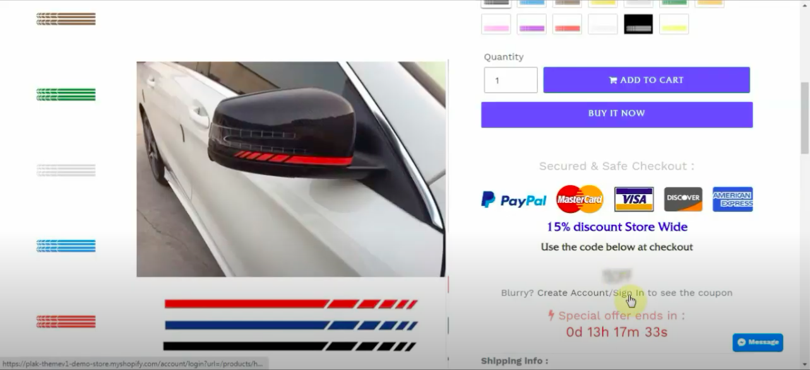

Newsletter signup popups have been the main way that e-commerce brands are collecting customer emails. But as a customer, it can be very annoying to be bombarded with a newsletter popup as well as privacy/cookie notice when arriving to a website. Poorly designed popups can be difficult to exit out of, especially on mobile. Entrance popups disrupt the shopping experience and in some cases, even causes people to leave the site from frustration. 

Today I'll talk about an alternative to entrance popups. An alternative that puts the customer in control of whether or not they want to offer their email, and a way that makes them happy to provide their email as they're closer to making a purchase. 

Now <a href="https://plaktheme.com/?wpam_id=75" target="_blank">Plak Theme</a> has developed an alternative to these popups. It's an innovative feature included in their theme that requires no app installation and promises to grow your subscribers list without any annoying popups.

**What’s wrong with entrance popups?**  

A recent case study showed that at least 80% of online shoppers hate popups, and if you're like me, when I shop online I usually close the popup straight away, without reading what's even on it.

**What are the main concerns about pop-ups from a user perspective?**

1. They are everywhere within the site. On some websites, the popups continue to appear as you navigate to other pages. You even receive popups as you intend to exit the website. 

2. They appear as soon as you land on a website. Imagine that you are visiting a website for the first time. There is a popup offering you 15% off your order in exchange for your email. You're not interested because you don't even know what the brand has to offer yet. By the time you have browsed the website, and perhaps decide that you want to purchase something, the popup is long gone and you have missed the opportunity to receive the coupon code. 

3. They appear every time you land on the site. If you've already taken advantage of a discount code once from a certain website, it can be very annoying to continue to receive this popup although you're already familiar with the website and brand. 

4. Not mobile-friendly. Some popups are not mobile-friendly. They may hide the entire site content and it can be difficult and frustrating to find the button to close the popup. When a customer cannot find the close button, or doesn't realize that they must tap out of the popup on mobile, they often leave the website and you've lost your change with that customer. In addition, when buttons or content are off-screen, Google notices and this could ultimately negatively affect your SEO ranking.

5. Search engines discourage Shopify stores from using popups. Google developers know it is bad for the user experience, bounce rate, exit rate, and even the time spent on the website. If content is immediate and uninterrupted, consumers are far more likely to explore the site and ultimately make the conversion.

6. Popups affect the site speed. Any extra feature on your Shopify store requires additional scripts, code and CSS. Additional content will impact the site speed, and these small speed reductions add up to create disruptive loading times that can affect your conversion rate.

**What’s the alternative?**  

In order to find the best alternative to increase email list subscribers, <a href="https://plaktheme.com/?wpam_id=75" target="_blank">Plak Theme</a> developers engineered an exclusive feature which has been a highly effective way to collect subscribers' emails. This feature is called Blurry Coupon.

How does Blurry Coupon work? When a visitor (non-subscriber) lands on your product or blog page, the coupon code discount is seen as a blurry image. Then this visitor must register or log in to see the coupon clearly. With this, stores can obtain new and highly engaged subscribers easily and without any popup that could damage SEO and harm the shopping experience.

Plak Theme thought about everything to enhance the user experience and make the navigation easier. Once the visitor registers or logs in, they automatically return to the previous page. This is a feature that only exists in themes developed by Plak Theme. Reducing the path to checkout is a critical process to increase the conversion rate. The less time visitors spend to reach checkout, the higher conversion rates will be.

A standard email collection method (such as using popups or a subscription box) takes about 8 steps to reach checkout, while the blurry coupon takes just 3 steps while staying on the same product page. The Blurry Coupon feature reduces the checkout reach path by 62%.

**With Blurry Coupon, the path is:** Register/Log in > Add to cart > Checkout  
**With a standard email collection method:** Fill the form > check inbox > Find the email (may fall into spam or promotions area) > Copy the coupon > go back to the site > search the product > Add to cart > Checkout

In addition to faster checkout, and better user experience, you will have high quality and engaged subscribers. A subscriber who has entered their email address with astandard email collection method maybe did it out of curiosity and may wait for the email for some time which sometimes falls into the spam folder. Because the user has to leave your website to obtain the coupon code, they may never come back to the website to place an order.

In comparison, a subscriber from the Blurry Coupon feature is considered a potential buyer as soon they sign up from the product page. They will see the coupon immediately when ready to make a purchase, and they'll be automatically redirected to the previous product page.

As <a href="https://plaktheme.com/?wpam_id=75" target="_blank">Plak Theme</a> is super fast, the time between the signup and the time he will see the coupon is at only 1- 2 seconds. The chances that this subscriber reaches checkout to place an order using the discount code is extremely high.

It's time to reconsider the very popular entrance popup. They're annoying, and now with <a href="https://plaktheme.com/?wpam_id=75" target="_blank">Plak Theme</a>, a better alternative exists.